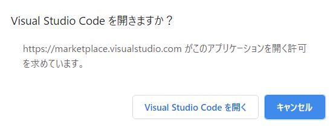
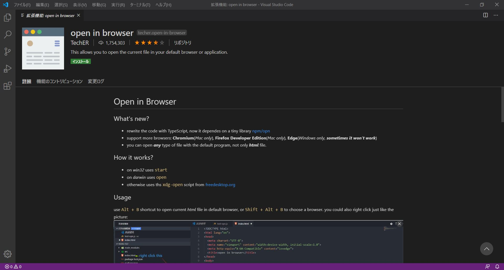
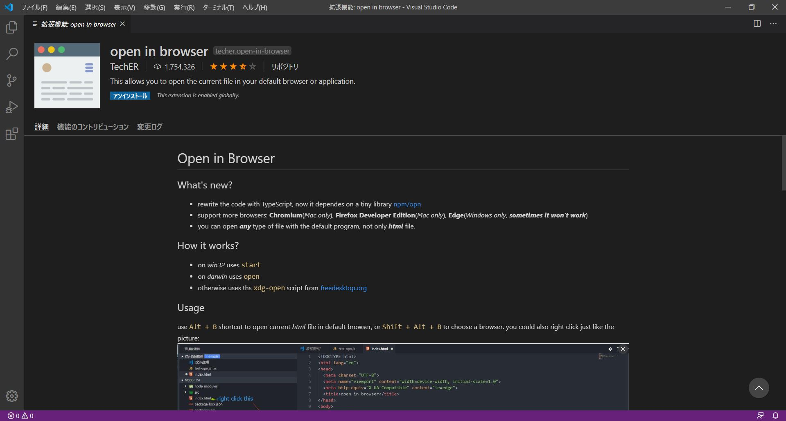
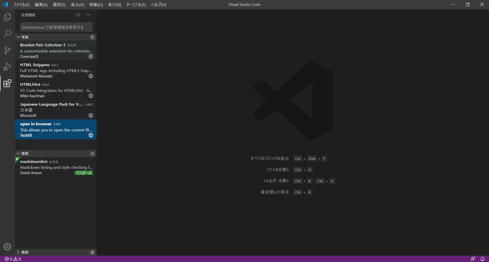
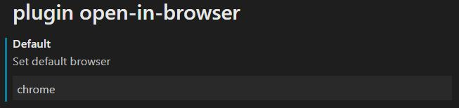

# 初心者向けvscode拡張機能

vscodeには拡張機能といって後付けできる便利機能がたくさんあります

そこでまず本題のHTMLの各種タグの説明をする前に、拡張機能を使ってvscodeを使いやすくしておきましょう

拡張機能はネット上の[Visual Studio MarketplaceのVisual Studio Code向けの拡張機能一覧ページ](https://marketplace.visualstudio.com/)から検索をかけて選び、インストールして使うことができます

なお、拡張機能を有効化するためには、インストール後にvscodeを再起動する必要がありますのでご注意ください

初心者の方で「どんな拡張機能を入れたら良いか分からないよ」という方には以下の拡張機能を入れることをお勧めします

## 日本語化：[Japanese Language Pack](https://marketplace.visualstudio.com/items?itemName=MS-CEINTL.vscode-language-pack-ja)

vscodeの表示が日本語になります

## 括弧に色付け：[Bracket Pair Colorizer 2](https://marketplace.visualstudio.com/items?itemName=CoenraadS.bracket-pair-colorizer-2)

括弧の種類や階層ごとに色を変えられます  
コード可読性が上がります

## HTMLタグ補完機能：[HTML Snippets](https://marketplace.visualstudio.com/items?itemName=abusaidm.html-snippets)

補完機能により、HTMLタグの入力が非常に簡単になります

## HTML構文チェッカー：[HTMLHint](https://marketplace.visualstudio.com/items?itemName=mkaufman.HTMLHint)

HTMLの構文に不備が生じると自動的に指摘してくれるので、エラー解消が早まります

## HTMLプレビュー：[open in browser](https://marketplace.visualstudio.com/items?itemName=techer.open-in-browser)

選択中のHTMLファイルをコマンド一つ（Alt + B）でブラウザで開くことできます
ただしインストール後、デフォルトブラウザを設定する必要があります

# 拡張機能インストール手順

拡張機能のひとつである`open in browser`を例に、拡張機能のインストール手順を紹介します

なお、どの拡張機能も手順は同じです

１．上記の`open in browser`へのリンクからインストールページへ行き、赤矢印で示された緑の「**install**」をクリックします

（インストールページへは[vscode拡張機能一覧ページ](https://marketplace.visualstudio.com/)から名前を検索して行くこともできます）


２．画像のように問われるので、「Visual Studio Code を開く」を選択します



３．画面左上の緑の「**インストール**」をクリックします



４．インストールが終わると緑の「**インストール**」ボタンが青の「**アンインストール**」ボタンに変わりますので、ウィンドウを閉じて再度開けばインストールと有効化が完了します



５．インストールされ有効化された拡張機能の状況はウィンドウ左の縦に並んだアイコンの一番下の四角いアイコンをクリックすると確認できます  
「有効」の下に入っていればOKです



注：`open in browser`はインストール後にデフォルトブラウザを設定する必要があります  
このように拡張機能によってはインストール後に設定する必要があるので注意してください

<dl>
    <dt>デフォルトブラウザの設定手順</dt>
        <dd>1.ウィンドウ左上の「ファイル」をクリック</dd>
        <dd>2.開いたタブの中の「基本設定」をクリック</dd>
        <dd>3.開いたタブの中の「設定」をクリック</dd>
        <dd>4.「設定」が開くので下の方の「拡張機能」をクリック</dd>
        <dd>5.使用可能な拡張機能一覧が開くので「plugin open-in-browser」をクリック</dd>
        <dd>6「Set default browser」の下の欄に使いたいブラウザ名を入力</br>
        色んな表現を拾って認識してくれる仕様になっており、例えばGoogle Chromeなら「chrome」で通じる↓</dd>
</dl>



# HTMLタグとは

それでは「HTMLのタグとは？」という所からから学んでいきましょう

HTMLにはたくさんの種類のタグが用意されており、タグを用いてHTML構文を作ることで様々な表現をすることができます

HTMLの構文は基本的に**開始タグと閉じタグ**が対になっており、開始タグは`<タグ名>`、閉じタグは`</タグ名>`で表します

開始タグと閉じタグの間には**表示したい文字**を入力します

例えば

h1タグなら　　　　`<h1>１．大見出し</h1>`  
aタグなら　　　　　`<a href="#">２．ページ先頭へ行くリンク</a>`  
strongタグなら　　`<strong>３．強調</strong>`

と書くことができます

これらのHTML構文はウェブブラウザでは以下のように表現されます

<h1>１．大見出し</h1>
<a href="#">２．ページ先頭へ行くリンク</a><br>
<strong>３．強調</strong>  

HTMLではこのようにタグで囲むことでその間の文字の表現を変えることができます

ただし、いくつか閉じタグが必要ないタグも存在します

代表的なのは``です

これは画像を表示するためのタグです

# 見出し：`<h1>~<h6>`

HTMLには大きさの異なる6種類の見出しを表すタグがあります

それらのタグは`h[１～６の数字]`で表現されます

数字が大きくなるほど見出しは小さくなっていきます

**h**は英語で言う見出しの意味のHeadingの頭文字に由来します

## 【HTML構文】

```
<h1>見出し１</h1>
<h2>見出し２</h2>
<h3>見出し３</h3>
<h4>見出し４</h4>
<h5>見出し５</h5>
<h6>見出し６</h6>
```

## 【ブラウザでの表示】

<h1>見出し１</h1>
<h2>見出し２</h2>
<h3>見出し３</h3>
<h4>見出し４</h4>
<h5>見出し５</h5>
<h6>見出し６</h6>

# 段落：`<p>`

段落を作る際には`<p>`を用います

**p**は英語で言う見出しの意味のParagraphの頭文字に由来します

文章を`<p>`と`</p>`で囲むことで、ひとつの段落として表現できます

## 【HTML構文】

```
<p>当サロンは、「アラサーが人生を大逆転する」ということを目的として設立したサロンです。</p>
<p>その目的があれば基本は誰でも入会可能。</p>
<p>プログラミング、デザイン、ブログ、YouTube、その他SNSなど、様々な手段を使って人生を大逆転する方法を研究していきましょう。</p>
```

## 【ブラウザでの表示】

<p>当サロンは、「アラサーが人生を大逆転する」ということを目的として設立したサロンです。</p>
<p>その目的があれば基本は誰でも入会可能。</p>
<p>プログラミング、デザイン、ブログ、YouTube、その他SNSなど、様々な手段を使って人生を大逆転する方法を研究していきましょう。</p>

# スパン：`<span>`

`<span>`は少し変わっていて単体では意味を持たないタグです

`<span>`と`</span>`で囲われた範囲の文字列は「`<span>`に要求された装飾の対象」とすることができます

例えば段落中の一部の文字を赤い太字にしたい場合、以下のように使うことができます

## 【HTML構文】

```
<p>当サロンは、<span style="color:red;font-weight:bold">「アラサーが人生を大逆転する」</span>ということを目的として設立したサロンです。</p>
```

## 【ブラウザでの表示】

<p>当サロンは、<span style="color:red;font-weight:bold">「アラサーが人生を大逆転する」</span>ということを目的として設立したサロンです。</p>

## コメント：`<!--コメント-->`

HTMLに限りませんがコードを書く時には**作業性を上げるためにコメントを入れる**のが一般的です

コメントというのは**コードとして反映されない表記**のことで、主な使い方は以下のようなものがあります

- コードの意味を補足して分かりやすくする
- これから足さなければならないコードの位置を示す
- エラーが出るときに原因と思われる部分をコメントとしてコードから除外して検証する

HTMLではコメントとしたい部分を`<!--`と`-->`で囲みます

コメントは複数行にまたがることも可能です

## 【HTML構文】

```
<p>あいうえお</p>
<!-- コメント１ -->
<p>かきくけこ</p> <!-- コメント２－１
コメント２－２ -->
<!-- <p>さしすせそ</p> -->
```

## 【ブラウザでの表示】

<p>あいうえお</p>
<!-- コメント１ -->
<p>かきくけこ</p> <!-- コメント２－１
コメント２－２ -->
<!-- <p>さしすせそ</p> -->

# リンク：`<a>`

`<a>`と`</a>`で囲んだ部分がリンクとして機能するようになります

```
<a href="リンク先のURL">リンクとして表示する文字<a>
```
リンク先はこのようにhref**属性**を用いて`href="リンク先のURL"`として指定します

HTMLのタグにはこのような**属性**と言われるオプションのようなものがたくさんあります

`<a>`タグを用いてリンクを作る場合、デフォルトでは同しページにリンク先のページを開いてしまいます

新たなページ（タブ）でリンク先のページを開きたい時は以下のようにtarget属性とrel属性を追加で指定します

```
<a href="リンク先のURL" target="_blank" rel="noopener">リンクとして表示する文字</a>
```

`target="_blank"`は新しいタブでページを開くという意味で、`rel="noopener"`は開いた新たなページから元のページを操作できないようにするセキュリティ上の対策です

## 【HTML構文】

```
<a href="https://www.google.com/maps">グーグルマップ</a><br>
<a href="https://www.google.com/maps" target="_blank">グーグルマップ（別タブ）</a>

```

## 【ブラウザでの表示】

<a href="https://www.google.com/maps">グーグルマップ</a><br>
<a href="https://www.google.com/maps" target="_blank">グーグルマップ（別タブ）</a>

# 画像：``

``は画像を表示するために使うタグです

閉じタグはなく、src属性で画像ファイルのURLを指定します

画像ファイルはネット上のものでもローカル環境内のものでも表示可能です

ローカルのファイルを指定する際は「記述するHTMLファイルから見た相対パス」を入力します

```

```

`width`と`height`はオプションの属性なので、付けない場合は元のサイズになります

alt属性は画像をテキストで説明するための属性で、これもオプションです

以下のような目的で使用されます

- 目が不自由な人などが音声でHTMLファイルを聞くため
- 画像データをロードしないように設定している人でも内容が分かるようにするため

alt属性の説明は画像が伝えたいことが伝わるように書くべきです

例えば会社ロゴの場合、説明が"会社のロゴ"では不親切です

ロゴに文字が入っているならその文字を説明に含めて、どんなロゴなのか分かるようにするべきです

ちなみに、srcはsource（画像読み込み元）、altはalternative（代替物）から来ています

## 【HTML構文】

```
<!-- ネット上の画像を読み込む場合、画像は「HTML5」 -->


<!-- ローカルのファイル（imagesフォルダ内のruby.png）を読み込む場合、画像は「Ruby」 -->


```

## 【ブラウザでの表示】


# リスト：`<ul>,<ol>,<li>`

`<ul>`は順序のないリスト（unsorted list）を、`<ol>`は順序のあるリスト（ordered list）を作ります

`<li>`は個々のリストの項目を指定するためのタグです

`<li>`には閉じタグが必要ありません（付けても良いです）

## 【HTML構文】

```
<p>順序のないリスト</p>
<ul>
    <li>HTML
    <li>CSS
    <li>Ruby
    <li>Ruby on Rails
    <li>Git
    <li>SQL
</ul>

<p>順序のあるリスト</p>
<ol>
    <li>HTML
    <li>CSS
    <li>Ruby
    <li>Ruby on Rails
    <li>Git
    <li>SQL
</ol>
```

## 【ブラウザでの表示】

<p>順序のないリスト</p>
<ul>
    <li>HTML
    <li>CSS
    <li>Ruby
    <li>Ruby on Rails
    <li>Git
    <li>SQL
</ul>

<p>順序のあるリスト</p>
<ol>
    <li>HTML
    <li>CSS
    <li>Ruby
    <li>Ruby on Rails
    <li>Git
    <li>SQL
</ol>

# テーブル：`<table>`

`<table>`は表を作るために使用するタグです

`<table>`タグの中でいくつかのタグ（`<caption>`,`<tr>`,`<th>`,`<td>`など）を使うことで表を調整することができます

表記述の決まり事を羅列します

- `<table>`タグで囲まれた範囲が表になる
- `<caption>`タグで囲まれた範囲が表のタイトルになる
- `<tr>`タグで囲まれた範囲が表の一行になる
- `<th>`タグで囲まれた範囲は太字（見出しとして）表の一列になる
- `<td>`タグで囲まれた範囲が表の一列になる

少し複雑なので下のHTML構文とブラウザでの表示を見比べて、合っているか確認してみてください

表はどうしてもコードが読みづらくなるので、インデントをしっかりとって分かりやすく記述することがエラー回避につながります

表では他にも`<thead>`,`<tbody>`,`<tfoot>`といったタグも使うことができます

必要に応じて調べるようにしましょう

## 【HTML構文】

```
<table>
    <caption>囚人のジレンマ</caption>
    <tr>
        <th>A\B</th>
        <td>自白</td>
        <td>黙秘</td>
    </tr>
    <tr>
        <td>自白</td>
        <td>A: -5, B: -5</td>
        <td>A: 0, B: -10</td>
    </tr>
    <tr>
        <td>黙秘</td>
        <td>A: -10, B: 0</td>
        <td>A: -2, B: -2</td>
    </tr>
</table>
```

## 【ブラウザでの表示】

<table>
    <caption>囚人のジレンマ</caption>
    <tr>
        <th>A\B</th>
        <td>自白</td>
        <td>黙秘</td>
    </tr>
    <tr>
        <td>自白</td>
        <td>A: -5, B: -5</td>
        <td>A: 0, B: -10</td>
    </tr>
    <tr>
        <td>黙秘</td>
        <td>A: -10, B: 0</td>
        <td>A: -2, B: -2</td>
    </tr>
</table>

# フォーム：`<form>`

「ユーザーがウェブページから何かしらの値を入力・送信するためのフォーム」を作るために`<form>`タグを使います

`<form>`では値の送信先、値の送信方法、値（データ）の形式などを指定することができます

そのために以下の属性を使用します

`<form>`の主な属性

- action：値の送信先
- method：値の送信方法

`action`属性の使い方

フォームの入力値の送信先URLを指定します

```
<form action="sample.php"> ～フォーム部品～ </form>
```

`method`属性の使い方

フォームの入力値の送信方法（HTTPメソッド）を指定します

`method`属性が取れる値（送信方法）には`get`と`post`という２種類があります

どちらも値を送信する点では同じですが、その方法が異なります

`get`メソッドでは入力値をURLに載せて送りますが、`post`メソッドでは入力値をHTTPリクエストに載せて送ります

```
<form action="sample.php" method="get"> ～フォーム部品～ </form>
<form action="sample.php" method="post"> ～フォーム部品～ </form>
```

## 【HTML構文】

```
<form action="sample.php" method="post">
    [フォーム部品１]<br>
    [フォーム部品２]<br>
    [フォーム部品３]<br>
    [...]<br>
    [送信ボタン]
</form>
```

## 【ブラウザでの表示】

<form action="" method="post">
    [フォーム部品１]<br>
    [フォーム部品２]<br>
    [フォーム部品３]<br>
    [...]<br>
    [送信ボタン]
</form>


ユーザーの入力を受けるためには、`<form>`の開始タグと閉じタグの間に必要な**フォーム部品**（入力欄、プルダウン、チェックボックス、送信ボタンなど）を設置します

なお、送信ボタンは入力データを送るために必須になります

フォーム部品は様々な種類があり、しかも本当に様々な使い方があるので全ては紹介できませんが、主要なものをピックアップして紹介します

## フォーム部品１：`<input>`

`<input>`はユーザーが入力するフォーム部品を作るためのタグです

`<input>`の主な属性（これ以外もたくさんあります）

- type：様々なフォーム部品の種類
    - maxlength：入力可能な最大文字数を指定（`type="text" or "password"`のとき）
    - minlength：入力すべき最小文字数を指定（`type="text" or "password"`のとき）
    - accept：選択できるファイルの拡張子を指定（`type="file"`のとき）
- name：フォーム部品の名前or呼び名（表示されない、入力値の受け渡し時の**ID**となる）
- value：フォーム部品の初期値
- size：フォーム部品の幅
- require：入力必須を指定

`type`属性が取る主な値

- text：一行の文字列入力欄
- password：パスワード用の一行の文字列入力欄
- radio：ラジオボタン（複数のうち一つだけにチェックできる）
- checkbox：チェックボックス（いくつでもチェックできる）
- file：ファイルを選択
- reset：フォーム内のすべての入力をリセットするボタン
- submit：フォームに入力された値を送信するボタン
- button：汎用的なボタン

補足

- `type="radio"`の時は`name="グループ名"`として複数のラジオボタンがひとつのグループであることを示す必要があります
- `type="button"`の時は`value="ボタンに表示する文字"`としてボタンの文字を設定します（デフォルトで`submit`は「送信」、`reset`は「リセット」になっているが同様の手順で変更可能）

`maxlength`属性が取る値：任意の数値

`minlength`属性が取る値：任意の数値

`accept`属性が取る値：固有ファイル型指定子、複数種類指定可能<br>
固有ファイル型指定子=>`audio/*`：任意の音声ファイル、`video/*`：任意の動画ファイル、`image/*`：任意の画像ファイル、`.jpg`：jpg、`.pdf`：pdfなど

`name`属性が取る値：任意の文字列

`value`属性が取る値：任意の文字列

`size`属性が取る値：任意の数値

`required`属性が取る値：なし（`required`単体で使う）

### 【HTML構文】

```
<form>
    <input name="text1" type="text" required>＊入力必須<br>
    <input name="text2" type="text" minlength="6">＊最低6文字<br>
    <input name="text3" type="text" value="初期値"><br>
    <input name="text4" type="text" size=40><br>
    <input name="password1" type="password"><br>
    <input name="group1" type="radio" value="g1-1">
    <input name="group1" type="radio" value="g1-2">
    <input name="group1" type="radio" value="g1-3">
    <input name="group2" type="radio" value="g2"><br>    
    <input name="checkbox1" type="checkbox"><br>
    <input name="file1" type="file" accept=".png,.jpg"><br>
    <input type="reset"><br>
    <input type="reset" value="入力値消去"><br>
    <input type="submit"><br>
    <input type="button" value="ボタン">
</form>
```

### 【ブラウザでの表示】

<form>
    <input name="text1" type="text" required>＊入力必須<br>
    <input name="text2" type="text" minlength="6">＊最低6文字<br>
    <input name="text3" type="text" value="初期値"><br>
    <input name="text4" type="text" size=40><br>
    <input name="password1" type="password"><br>
    <input name="group1" type="radio" value="g1-1">
    <input name="group1" type="radio" value="g1-2">
    <input name="group1" type="radio" value="g1-3">
    <input name="group2" type="radio" value="g2"><br>    
    <input name="checkbox1" type="checkbox"><br>
    <input name="file1" type="file" accept=".png,.jpg"><br>
    <input type="reset"><br>
    <input type="reset" value="入力値消去"><br>
    <input type="submit"><br>
    <input type="button" value="ボタン">
</form>

## フォーム部品２：`<select>`&`<option>`

`<select>`はユーザーが選択肢から選ぶフォームを作るためのタグです

`<select>`と`</select>`の間に`<option>`タグを設置して選択肢を作ります

`<select>`の主な属性

- name：フォーム部品の名前or呼び名（表示されない、入力値の受け渡し時の**ID**となる）
- size：画面に一度に表示する行数を指定します。デフォルトは1です

`name`が取る値：任意の文字列

`size`属性が取る値：任意の数値

`<option>`の主な属性

- value：受け渡し用の選択項目の値
- selected：デフォルトで選択された状態にする

`value`属性が取る値：任意の文字列

`selected`が取る値：なし（`selected`単体で使う）

### 【HTML構文】

```
<form>
		<select name="select1">
			<option value="sample11">サンプル1-1</option>
			<option value="sample12">サンプル1-2</option>
			<option value="sample13">サンプル1-3</option>
		</select>
		<select size="3" name="select2">
			<option value="sample21">サンプル2-1</option>
			<option value="sample22">サンプル2-2</option>
			<option value="sample23" selected>サンプル2-3</option>
			<option value="sample24">サンプル2-4</option>
			<option value="sample25">サンプル2-5</option>
		</select>
</form>
```

### 【ブラウザでの表示】

<form>
		<select name="select1">
			<option value="sample11">サンプル1-1</option>
			<option value="sample12">サンプル1-2</option>
			<option value="sample13">サンプル1-3</option>
		</select>
		<select size="3" name="select2">
			<option value="sample21">サンプル2-1</option>
			<option value="sample22">サンプル2-2</option>
			<option value="sample23" selected>サンプル2-3</option>
			<option value="sample24">サンプル2-4</option>
			<option value="sample25">サンプル2-5</option>
		</select>
</form>

## フォーム部品３：`<textarea>`

`<textarea>`は複数行の入力欄を作るために使うタグです

`<textarea>`で作った入力欄は**右下隅をドラッグすることで**自在に大きさを変えられます

`<textarea>`の主な属性

- cols：入力欄の幅を指定する=>任意の数値を取る
- rows：入力欄の高さを指定する=>任意の数値を取る
- name：フォーム部品の名前or呼び名（表示されない、入力値の受け渡し時の**ID**となる）=>任意の文字列を取る
- maxlength：入力可能な最大文字数を指定
- minlength：入力すべき最小文字数を指定


### 【HTML構文】

```
<form>
	<textarea name="textarea1" rows="2" cols="30">2×30</textarea><br>
    <textarea name="textarea1" rows="6" cols="50" maxlength="300">6×50</textarea>
</form>
```

### 【ブラウザでの表示】

<form>
	<textarea name="textarea1" rows="2" cols="30">2×30</textarea><br>
    <textarea name="textarea1" rows="6" cols="50" maxlength="300">6×50</textarea>
</form>

# ボタン：`<button>`

`<button>`はボタンを設置するときに使用します

開始タグと閉じタグの間にボタン上に表示したい文字列を書きます

コード：`<button>押してみてね</button>`

表示：<button>押してみてね</button>

基本的な使い方はこれだけです

ただし、`<button>`には以下の4つの属性があり、これらを使いこなすことで様々な用途に適用できます

`<button>`の主な属性

- type：３つあるボタンの種類のいずれかを指定
- name：フォーム部品の名前or呼び名（表示されない、入力値の受け渡し時の**ID**となる）=>任意の文字列を取る
- value：送信する値
- disabled：動作を無効化する
- onclick：クリック時に作動する挙動を設定

`type`属性が取る値

- submit：フォームの入力内容を送信するボタン
- reset：フォームの入力内容を一掃するボタン
- button：何もしないただのボタン

デフォルトでは暗黙に`type="submit"`となっています

`<input>`でも同じ機能を持つフォームの送信ボタンは作れますが、`<button>`は閉じタグがあるので子要素を使ってデザインに幅を持たせることができます

`name`属性が取る値：任意の文字列

`value`属性が取る値：任意の文字列

`disabled`属性が取る値：なし（`disabled`単体で使う）

`onclick`属性が取る値：

- `"location.href='遷移先URL'"`（ボタンをウェブページへのリンクとして使うときに有効です）
- JavaScriptで定義した処理（HTML教材の範囲から外れるので詳細は割愛します）

## 【HTML構文】

```
<!--フォームの送信ボタン-->
<form>
お名前：<input type="text">
<button name="name" value="value">送信</button>
</form>

<!--RubyInstallerへのリンクボタン-->
<button type="button" onclick="location.href='https://rubyinstaller.org/'">RubyInstaller</button>
```

## 【ブラウザでの表示】

<!--フォームの送信ボタン-->
<form>
お名前：<input type="text">
<button name="name" value="value">送信</button>
</form>

<!--RubyInstallerへのリンクボタン-->
<button type="button" onclick="location.href='https://rubyinstaller.org/'">RubyInstaller</button>

# HTMLの定型

これまでは個別のタグについて見てきましたが、HTMLにはどのファイルにも共通する基本的なタグが存在します

以下のタグが代表的です

- `<!DOCTYPE>`
- `<html>`
- `<head>`
- `<meta>`
- `<title>`
- `<link>`
- `<body>`

HTMLファイルの基本形は以下のようになります

```
<!DOCTYPE [htmlバージョン指定文]>
<html>
  <head>
    <meta charset="[文字コード]">
    <title>[タイトル]</title>
    <link rel="stylesheet" href="[スタイルシートのパス]">
  </head>
  <body>
    [ページ内容を構成する個別のタグ]
  </body>
</html>
```

# HTMLのバージョンを宣言：`<!DOCTYPE>`

HTMLファイルの先頭に書くことで（`<html>`タグより前に）、そのファイルで用いるHTMLのバージョンを宣言するものです

HTMLにはバージョンがあり、バージョンごとに書き方や属性の内容が異なることがあるため、宣言しておく必要があります

```
<!--HTML4の場合（注：HTML4の中にも3種類あります）-->
<!DOCTYPE HTML PUBLIC "-//W3C//DTD HTML 4.01 Transitional//EN" "http://www.w3.org/TR/html4/loose.dtd">

<!--HTML5の場合-->
<!DOCTYPE html>
```

# ファイルのタイプを指定：`<html>`

HTML文書であることを示す働きがあり、`<html>`タグの範囲内ではHTML構文が使えます

なお、`<html>`タグで囲まれた範囲の直下に`<head>`タグと`<body>`タグがそれぞれ必要になります

`<html>`はドキュメントの言語を指定する属性として`lang`を取れます

```
<!--日本語の場合-->
<html lang="ja">

<!--英語の場合-->
<html lang="en">
```

# HTML文書のメタ情報をまとめる：`<head>`

`<head>`タグは文書のメタ情報をまとめるタグです

メタ情報というのは、個別の内容ではなくて特徴や仕様を表した情報のことです

`<head>`で囲まれた範囲はブラウザでは表示されません

例えば、ページのタイトル、リンク情報、スタイルシート、筆者などなどを記載します

# タイトル：`<title>`

ページのタイトルを指定するためには`<title>`タグを使います

開始タグと閉じタグの間にタイトルを書きます

ここで記述したタイトルはブラウザのタブに表示されます

```
<title>ページタイトル</title>
```

# リンク情報：`<link>`

`<link>`タグはHTML文章が連携している外部ファイルを指定するために必要なタグです

使う場合には`rel`属性と`href`属性を必ず指定する必要があります

実際にはHTML文書を視覚的に装飾をするCSSファイルを読み込むために使われることがほとんどです

`<link>`の主な属性

- `rel`：この文書から見た参照先の文書との関係を指定
- `href`：参照先の文書のURLを指定、相対パスを使用

`rel`が取る値：リンクタイプ、以下例

- alternate：文書の代替ページを指定（例：スマホサイトでPCサイトを指定する）
- icon：文書のアイコンを読み込む
- stylesheet：スタイルシートを読み込む

`href`が取る値：URL

```
<!--stylesheet.cssという同フォルダの外部ファイルを読み込む-->
<link rel="stylesheet" href="stylesheet.css">
```

# 文字コードなどのHTML文書のメタ情報を指定：`<meta>`

`<meta>`タグは`<title>`タグなどで表せない文書のメタ情報を指定するためのタグです

文字コードを指定するために`charset`属性を使うケースが一般的です

こうすることで文字化けを防げます

```
<!--utf-8を指定-->
<meta charset="UTF-8">

<!--shift-jisを指定-->
<meta charset="shift-jis">
```

他には`name`属性と`content`属性を組み合わせることで以下のようなことができます

- 文書のキーワードを検索エンジンに知らせる=>１
- 文書の内容を検索エンジンに知らせる=>２
- 文書の作成者を記載しておく=>３

```
<!--1-->
<meta name="keywords" content="ruby,rubyonrails,git">
<!--2-->
<meta name="description" content="This text encourages students to understand what HTML is and how to use HTML tags.">
<!--3-->
<meta name="author" content="Who waits a prince">
```

# ページになる部分を指定：`<body>`

`<head>`では文書のメタ情報について記載しましたが、`<body>`では実際にページとして表示される部分を書きます

HTML4ではデザインに関わる属性がありましたが、HTML5からは廃止され裸で使うことが一般的です

`<head>`も`<body>`もひとつのHTMLファイルにひとつだけ使用します

```
<body>
    [ページ内容を構成する個別のタグ]
</body>
```
# `<body>`の要素：`<header>`, `<main>`, `<footer>`

`<body>`の中身にはおおよそ決まった書き方が存在します

どんなものかというと作成するウェブページのセクションごとに特定のタグで分割する書き方です

それらのセクションを分けるためのタグが以下の3つのタグです

- `<header>`：導入部やナビゲーションエリアを束ねる
- `<main>`：本体部分を束ねる
- `<footer>`：直前のセクションのフッター内容を束ねる

セクション分割が目的なので、`<h1>`や`<a>`のような機能はありません

ただ、囲まれた範囲がどんな役割を担っているのか分かりやすくなる利点があります

これらのタグを用いたHTMLファイルの一例は以下のようになります

```
<!DOCTYPE [htmlバージョン指定文]>
<html>
  <head>
    [メタ情報を記載するタグ]
  </head>
  <body>
    <header>
        [導入やナビを構成するタグ]
    </header>
    <main>
        [ページ本体を構成するタグ]
    </main>
    <footer>
        [ページや作者の情報を構成するタグ]
    </footer>
  </body>
</html>
```
# その他のセクション分割タグ：`<article>`, `<aside>`, `<nav>`, `<section>`, `<div>`

`<header>`, `<main>`, `<footer>`以外にもセクションを役割ごとに分けて括るためのタグに以下のようなものがあります

- `<article>`
- `<aside>`
- `<nav>`
- `<section>`
- `<div>`

ひとつずつ見ていきます

# 投稿や記事などを括る：`<article>`

`<article>`は投稿や記事といった自己完結する意味のまとまりを括るためのタグです

入れ子構造にする際は、内側の`<article>`タグで括った要素は外側の`<article>`タグで括った要素に関する情報にするようにします

```
<article>
    [記事や投稿を構成する範囲]
</article>
```

# 補足情報を括る：`<aside>`

`<aside>`は補足情報を示すセクションを括るために使います

```
<aside>
    [補足情報を示す範囲]
</aside>
```

# ナビゲーションを括る：`<nav>`

`<nav>`はナビゲーションを括るために使います
`<header>`は導入部やナビゲーションエリア全体をまとめるのに対して、`<nav>`は部分的なナビゲーションを括るのに使われます

# 役割やテーマごとにセクションを作る：`<section>`

`<section>`は上記のセクションを作るタグに当てはまらないようなセクション（意味の塊）を括るために使います

なんでもかんでも`<section>`を使うと意味が分かりづらくなるので、他のセクションをまとめるタグが使えるときはそちらを優先します

```
<section>
    [何かしらの役割やテーマを持つ範囲]
</section>
```

# 任意の範囲を分割：`<div>`

`<div>`タグはHTMLを任意の範囲で分割する（divide）ためのタグです

開始タグと閉じタグで任意の範囲を囲い、その範囲を一つのまとまりとすることができます

入れ子構造にすることも可能です

なお、`<div>`タグ自体に特に意味はありませんので、分割する範囲に意味合い的に適した他のタグがあれば、可読性の観点からそちらを優先するべきです

`<div>`ごとに`class`を指定して、CSSファイルでスタイルを割り当てるといった使い方をするので、CSSを学んでいないといまいち使い方が想像できないかと思います

単純化した具体例を考えると、`<div>`で範囲を分割しておくと、「この範囲のフォントサイズは20px、あの範囲の背景色は水色」などと`<div>`で分けた範囲ごとに見た目の仕様を簡単に変えることができます

```
<!--<div>タグ使用例-->

<div class="container">
    <div class="image-holder">
        [画像を表示に関する範囲]
    </div>
    <div class="text-holder">
        [文章を表示に関する範囲]
    </div>
</div>
```
