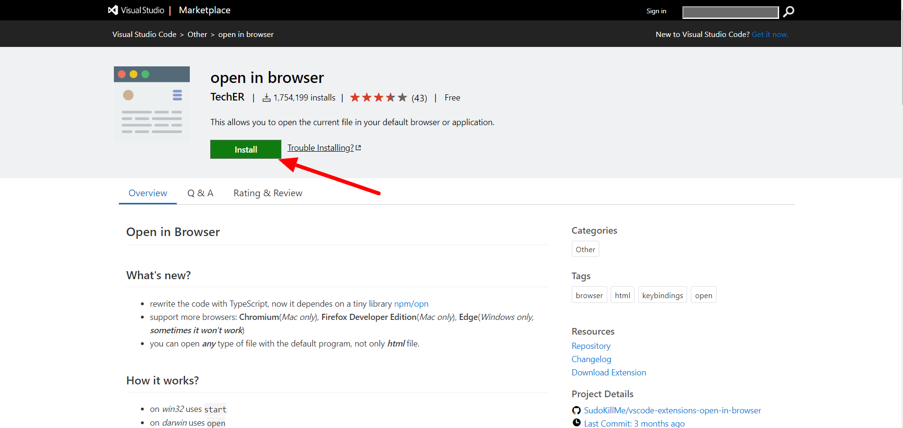

# 初心者向けvscode拡張機能

vscodeには拡張機能といって後付けできる便利機能がたくさんあります

そこでまず本題のHTMLの各種タグの説明をする前に、拡張機能を使ってvscodeを使いやすくしておきましょう

拡張機能はネット上の[Visual Studio MarketplaceのVisual Studio Code向けの拡張機能一覧ページ](https://marketplace.visualstudio.com/)から検索をかけて選び、インストールして使うことができます

なお、拡張機能を有効化するためには、インストール後にvscodeを再起動する必要がありますのでご注意ください

初心者の方で「どんな拡張機能を入れたら良いか分からないよ」という方には以下の拡張機能を入れることをお勧めします

## 日本語化：[Japanese Language Pack](https://marketplace.visualstudio.com/items?itemName=MS-CEINTL.vscode-language-pack-ja)

vscodeの表示が日本語になります

## 括弧に色付け：[Bracket Pair Colorizer 2](https://marketplace.visualstudio.com/items?itemName=CoenraadS.bracket-pair-colorizer-2)

括弧の種類や階層ごとに色を変えられます  
コード可読性が上がります

## HTMLタグ補完機能：[HTML Snippets](https://marketplace.visualstudio.com/items?itemName=abusaidm.html-snippets)

補完機能により、HTMLタグの入力が非常に簡単になります

## HTML構文チェッカー：[HTMLHint](https://marketplace.visualstudio.com/items?itemName=mkaufman.HTMLHint)

HTMLの構文に不備が生じると自動的に指摘してくれるので、エラー解消が早まります

## HTMLプレビュー：[open in browser](https://marketplace.visualstudio.com/items?itemName=techer.open-in-browser)

選択中のHTMLファイルをコマンド一つ（Alt + B）でブラウザで開くことできます
ただしインストール後、デフォルトブラウザを設定する必要があります

# 拡張機能インストール手順

拡張機能のひとつである`open in browser`を例に、拡張機能のインストール手順を紹介します

なお、どの拡張機能も手順は同じです

１．上記の`open in browser`へのリンクからインストールページへ行き、赤矢印で示された緑の「**install**」をクリックします

（インストールページへは[vscode拡張機能一覧ページ](https://marketplace.visualstudio.com/)から名前を検索して行くこともできます）



２．画像のように問われるので、「Visual Studio Code を開く」を選択します


３．画面左上の緑の「**インストール**」をクリックします


４．インストールが終わると緑の「**インストール**」ボタンが青の「**アンインストール**」ボタンに変わりますので、ウィンドウを閉じて再度開けばインストールと有効化が完了します


５．インストールされ有効化された拡張機能の状況はウィンドウ左の縦に並んだアイコンの一番下の四角いアイコンをクリックすると確認できます  
「有効」の下に入っていればOKです


注：`open in browser`はインストール後にデフォルトブラウザを設定する必要があります  
このように拡張機能によってはインストール後に設定する必要があるので注意してください

<dl>
    <dt>デフォルトブラウザの設定手順</dt>
        <dd>1.ウィンドウ左上の「ファイル」をクリック</dd>
        <dd>2.開いたタブの中の「基本設定」をクリック</dd>
        <dd>3.開いたタブの中の「設定」をクリック</dd>
        <dd>4.「設定」が開くので下の方の「拡張機能」をクリック</dd>
        <dd>5.使用可能な拡張機能一覧が開くので「plguin open-in-browser」をクリック</dd>
        <dd>6「Set default browser」の下の欄に使いたいブラウザ名を入力</br>
        色んな表現を拾って認識してくれる仕様になっており、例えばGoogle Chromeなら「chrome」で通じる↓</dd>
</dl>


# HTMLタグとは

それでは「HTMLのタグとは？」という所からから学んでいきましょう

HTMLにはたくさんの種類のタグが用意されており、タグを用いてHTML構文を作ることで様々な表現をすることができます

HTMLの構文は基本的に**開始タグと閉じタグ**が対になっており、開始タグは`<タグ名>`、閉じタグは`</タグ名>`で表します

開始タグと閉じタグの間には**表示したい文字**を入力します

例えば

h1タグなら　`<h1>１．大見出し</h1>`  
aタグなら　`<a>２．行先未設定リンク</a>`  
strongタグなら　`<strong>３．スパン</strong>`

と書くことができます

これらのHTML構文はウェブブラウザでは以下のように表現されます

<h1>１．大見出し</h1>
<a>２．行先未設定リンク</a><br>
<strong>３．強調</strong>

HTMLではこのようにタグで囲むことでその間の文字の表現を変えることができます

ただし、いくつか閉じタグが必要ないタグも存在します

代表的なのは`<!DOCTYPE>`です

これはHTMLファイルの先頭に書くことで、そのファイルで用いるHTMLのバージョンを宣言するものです

# 見出し：`<h1>~<h6>`

HTMLには大きさの異なる6種類の見出しを表すタグがあります

それらのタグは`h[１～６の数字]`で表現されます

数字が大きくなるほど見出しは小さくなっていきます

**h**は英語で言う見出しの意味のHeadingの頭文字に由来します

## 【HTML構文】

```
<h1>見出し１</h1>
<h2>見出し２</h2>
<h3>見出し３</h3>
<h4>見出し４</h4>
<h5>見出し５</h5>
<h6>見出し６</h6>
```

## 【ブラウザでの表示】

<h1>見出し１</h1>
<h2>見出し２</h2>
<h3>見出し３</h3>
<h4>見出し４</h4>
<h5>見出し５</h5>
<h6>見出し６</h6>

# 段落：`<p>`

段落を作る際には`<p>`を用います

**p**は英語で言う見出しの意味のParagraphの頭文字に由来します

文章を`<p>`と`</p>`で囲むことで、ひとつの段落として表現できます

## 【HTML構文】

```
<p>当サロンは、「アラサーが人生を大逆転する」ということを目的として設立したサロンです。</p>
<p>その目的があれば基本は誰でも入会可能。</p>
<p>プログラミング、デザイン、ブログ、YouTube、その他SNSなど、様々な手段を使って人生を大逆転する方法を研究していきましょう。</p>
```

## 【ブラウザでの表示】

<p>当サロンは、「アラサーが人生を大逆転する」ということを目的として設立したサロンです。</p>
<p>その目的があれば基本は誰でも入会可能。</p>
<p>プログラミング、デザイン、ブログ、YouTube、その他SNSなど、様々な手段を使って人生を大逆転する方法を研究していきましょう。</p>

# スパン：`<span>`

`<span>`は少し変わっていて単体では意味を持たないタグです

`<span>`と`</span>`で囲われた範囲の文字列は「`<span>`に要求された装飾の対象」とすることができます

例えば段落中の一部の文字を赤い太字にしたい場合、以下のように使うことができます

## 【HTML構文】

```
<p>当サロンは、<span style="color:red;font-weight:bold">「アラサーが人生を大逆転する」</span>ということを目的として設立したサロンです。</P>
```

## 【ブラウザでの表示】

<p>当サロンは、<span style="color:red;font-weight:bold">「アラサーが人生を大逆転する」</span>ということを目的として設立したサロンです。</P>

## コメント：`<!--コメント-->`

HTMLに限りませんがコードを書く時には**作業性を上げるためにコメントを入れる**のが一般的です

コメントというのは**コードとして反映されない表記**のことで、主な使い方は以下のようなものがあります

- コードの意味を補足して分かりやすくする
- これから足さなければならないコードの位置を示す
- エラーが出るときに原因と思われる部分をコメントとしてコードから除外して検証する

HTMLではコメントとしたい部分を`<!--`と`-->`で囲みます

コメントは複数行にまたがることも可能です

## 【HTML構文】

```
<p>あいうえお</p>
<!-- コメント１ -->
<p>かきくけこ</p> <!-- コメント２－１
コメント２－２ -->
<!-- <p>さしすせそ</p> -->
```

## 【ブラウザでの表示】

<p>あいうえお</p>
<!-- コメント１ -->
<p>かきくけこ</p> <!-- コメント２－１
コメント２－２ -->
<!-- <p>さしすせそ</p> -->

# リンク：`<a>`

`<a>`と`</a>`で囲んだ部分がリンクとして機能するようになります

```
<a href="リンク先のURL">リンクとして表示する文字<a>
```
リンク先はこのように`href="リンク先のURL"`として指定します

## 【HTML構文】

```
<a href="https://www.google.com/maps">グーグルマップ</a>
```

## 【ブラウザでの表示】

<a href="https://www.google.com/maps">グーグルマップ</a>

# 画像：``

``は画像を表示するために使うタグです

閉じタグはなく、src属性で画像ファイルのURLを指定します

画像ファイルはネット上のものでもローカル環境内のものでも表示可能です

ローカルのファイルを指定する際は「記述するHTMLファイルから見た相対パス」を入力します

```

```

`width`と`height`はオプションなので、付けない場合は元のサイズのなります

srcはsource（画像読み込み元）から来ています

## 【HTML構文】

```
<!-- ネット上の画像を読み込む場合、画像は「HTML5」 -->


<!-- ローカルのファイル（imagesフォルダ内のruby.png）を読み込む場合、画像は「Ruby」 -->


```

## 【ブラウザでの表示】


# リスト：`<ul>,<ol>,<li>`

`<ul>`は順序のないリスト（unsorted list）を、`<ol>`は順序のあるリスト（ordered list）を作ります

`<li>`は個々のリストの項目を指定するためのタグです

`<li>`には閉じタグがありません

## 【HTML構文】

```
<p>順序のないリスト</p>
<ul>
    <li>HTML
    <li>CSS
    <li>Ruby
    <li>Ruby on Rails
    <li>Git
    <li>SQL
</ul>

<p>順序のあるリスト</p>
<ol>
    <li>HTML
    <li>CSS
    <li>Ruby
    <li>Ruby on Rails
    <li>Git
    <li>SQL
</ol>
```

## 【ブラウザでの表示】

<p>順序のないリスト</p>
<ul>
    <li>HTML
    <li>CSS
    <li>Ruby
    <li>Ruby on Rails
    <li>Git
    <li>SQL
</ul>

<p>順序のあるリスト</p>
<ol>
    <li>HTML
    <li>CSS
    <li>Ruby
    <li>Ruby on Rails
    <li>Git
    <li>SQL
</ol>

# テーブル：`<table>`

`<table>`は表を作るために使用するタグです

`<table>`タグの中でいくつかのタグ（`<caption>`,`<tr>`,`<th>`,`<td>`など）を使うことで表を調整することができます

表記述の決まり事を羅列します

- `<table>`タグで囲まれた範囲が表になる
- `<caption>`タグで囲まれた範囲が表のタイトルになる
- `<tr>`タグで囲まれた範囲が表の一行になる
- `<th>`タグで囲まれた範囲は太字（見出しとして）表の一列になる
- `<td>`タグで囲まれた範囲が表の一列になる

少し複雑なので下のHTML構文とブラウザでの表示を見比べて、合っているか確認してみてください

表はどうしてもコードが読みづらくなるので、インデントをしっかりとって分かりやすく記述することがエラー回避につながります

表では他にも`<thead>`,`<tbody>`,`<tfoot>`といったタグも使うことができます

必要に応じて調べるようにしましょう

## 【HTML構文】

```
<table>
    <caption>囚人のジレンマ</caption>
    <tr>
        <th>A\B</th>
        <td>自白</td>
        <td>黙秘</td>
    </tr>
    <tr>
        <td>自白</td>
        <td>A: -5, B: -5</td>
        <td>A: 0, B: -10</td>
    </tr>
    <tr>
        <td>黙秘</td>
        <td>A: -10, B: 0</td>
        <td>A: -2, B: -2</td>
    </tr>
</table>
```

## 【ブラウザでの表示】

<table>
    <caption>囚人のジレンマ</caption>
    <tr>
        <th>A\B</th>
        <td>自白</td>
        <td>黙秘</td>
    </tr>
    <tr>
        <td>自白</td>
        <td>A: -5, B: -5</td>
        <td>A: 0, B: -10</td>
    </tr>
    <tr>
        <td>黙秘</td>
        <td>A: -10, B: 0</td>
        <td>A: -2, B: -2</td>
    </tr>
</table>

# ボタン：`<button>`

`<button>`はボタンを設置するときに使用します

ボタンの種類は